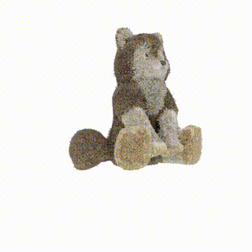

[](https://classroom.github.com/a/SdXSjEmH)
# EV-HW3: PhysGaussian

This homework is based on the recent CVPR 2024 paper [PhysGaussian](https://github.com/XPandora/PhysGaussian/tree/main), which introduces a novel framework that integrates physical constraints into 3D Gaussian representations for modeling generative dynamics.

You are **not required** to implement training from scratch. Instead, your task is to set up the environment as specified in the official repository and run the simulation scripts to observe and analyze the results.


## Getting the Code from the Official PhysGaussian GitHub Repository
Download the official codebase using the following command:
```
git clone https://github.com/XPandora/PhysGaussian.git
```


## Environment Setup
Navigate to the "PhysGaussian" directory and follow the instructions under the "Python Environment" section in the official README to set up the environment.


## Running the Simulation
Follow the "Quick Start" section and execute the simulation scripts as instructed. Make sure to verify your outputs and understand the role of physics constraints in the generated dynamics.


## Homework Instructions
Please complete Part 1–2 as described in the [Google Slides](https://docs.google.com/presentation/d/13JcQC12pI8Wb9ZuaVV400HVZr9eUeZvf7gB7Le8FRV4/edit?usp=sharing).

## Simulation Videos
I simulated ficus (which material is jelly) and wolf (which material is sand). These are the baseline simulation videos.
[ficus_baseline](https://youtube.com/shorts/ZtiO-7FijjU)
[wolf_baseline](https://youtube.com/shorts/X-KFijX-MaY)
## Parametes adjusting
### Ficus

| `n_grid`      |   PSNR    | GIF       | 
| ------------- | --------- | --------- |
| 30            |   38.26   |      |
| 35            |   38.16   |      | 
| 40  |   38.69   |      | 
| 45            |   38.47   |      | 
| 50   (baseline)         |   76.36   |      | 

| `substep_dt`      |   PSNR    | GIF       | 
| ------------- | --------- | --------- |
| 2e-05         |   38.05   |      |
| 4e-05         |   38.13   |      | 
| 6e-05         |   38.34   |      | 
| 8e-05         |   38.96   |      | 
| 1e-04 (baseline)        |   76.54   |      | 

| `grid_v_damping_scale`      |   PSNR    | GIF       | 
| ------------- | --------- | --------- |
| 0.0999            |   38.14   |      |
| 0.4999            |   38.14   |      | 
| 0.9999 (baseline) |   76.44   |      | 
| 1.4999            |   37.65   |      | 
| 1.9999            |   37.65   |      | 

| `softening`      |   PSNR    | GIF       | 
| ------------- | --------- | --------- |
| 0.001         |   76.40   |      |
| 0.005         |   76.11   |      | 
| 0.01          |   76.13   |      | 
| 0.05          |   76.15   |      | 
| 0.1           |   76.36   |      | 

### Wolf
| `n_grid`      |   PSNR    | GIF       | 
| ------------- | --------- | --------- |
| 120            |   41.20   |      |
| 140            |   41.38   |      | 
| 160            |   41.72   |      | 
| 180            |   41.21   |      | 
| 200 (baseline) |   69.09   |      | 

| `substep_dt`      |   PSNR    | GIF       | 
| ------------- | --------- | --------- |
| 1e-05         |    42.05   |      |
| 2e-05 (baseline)         |    69.09  |      | 
| 4e-05         |    42.08   |      | 
| 5e-05         |    41.65   |      | 
| 6e-04         |    39.55   |      | 

| `grid_v_damping_scale`      |   PSNR    | GIF       | 
| ------------- | --------- | --------- |
| 0.0999            |   40.13   |      |
| 0.4999            |   40.16   |      | 
| 0.9999            |   42.49   |      | 
| 1.4999            |   69.48   |      | 
| 1.9999            |   68.96   |      | 

| `softening`      |   PSNR    | GIF       | 
| ------------- | --------- | --------- |
| 0.001         |   69.43   |      |
| 0.005         |   69.30   |      | 
| 0.01          |   69.16   |      | 
| 0.05          |   69.33   |      | 
| 0.1           |   69.33   |      | 

# Reference
```bibtex
@inproceedings{xie2024physgaussian,
    title     = {Physgaussian: Physics-integrated 3d gaussians for generative dynamics},
    author    = {Xie, Tianyi and Zong, Zeshun and Qiu, Yuxing and Li, Xuan and Feng, Yutao and Yang, Yin and Jiang, Chenfanfu},
    booktitle = {Proceedings of the IEEE/CVF Conference on Computer Vision and Pattern Recognition},
    year      = {2024}
}
```
